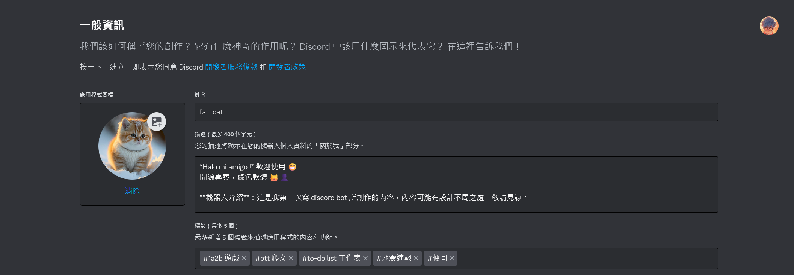
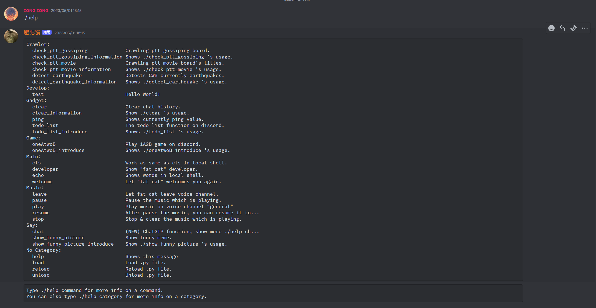

# 基於在 Discord 上的聊天機器人 
# Discord ChatBot fat_cat 

基於在 Discord 上的聊天機器人 fat_cat。  
使用 Python 架設聊天機器人，配合爬蟲、disocrd API 調用實現。  

> 2024/05/05 啟用維護，參見[日誌](#日誌)。

- #### 範例圖片
<div align = "center"></div>
<div align = "center"></div>
<div align = "center"></div>
<div align = "center"></div>
<div align = "center"></div>  

---

## 目錄
- [目錄](#目錄)
- [開發環境](#開發環境)
- [如何執行](#如何執行)
- [版本差異](#版本差異)
- [日誌](#日誌)
- [貢獻](#貢獻)
- [著作權](#著作權)

---

## 開發環境

- Windows Home 10 64bit
- VScode
- Python `3.7.0`
- numpy `1.21.6`
- requests `2.27.1`
- discord `1.7.3`
- discord.py `1.7.3`
- yt-dlp `2022.5.18`
- beautifulsoup4 `4.11.1`

---

## 如何執行

> 預設 ***Windows Home 10 64bit*** 作業系統  

步驟 一：注意 ***.env*** 是否可用，若無法使用可參考使用 ***.json*** 。  

步驟 二：***.env***：記得填入 ***.env*** 需要的必要資料。  

步驟 二：執行機器人  

- 方法一：直接點兩下執行 `Bot.py`    
>
- 方法二：使用終端機

```bash
cd Python-discord-chatbot-fat_cat/tiny
```
```bash
python Bot.py
```
---

## 版本差異

| 版本 | 描述 |
| :--: | ---- |
| tiny v1.0 | 現階段已完成。 |

---

## 日誌

| 時間 | 事件 |
| :--: | ---- |
| 2024/05/05 | 資料救援回復 **2022** 編輯紀錄，重新開始維護！ |

---

## 貢獻

獨立開發。

---

## 著作權

此專案受到 [GPL-3.0](https://www.gnu.org/licenses/gpl-3.0.zh-tw.html) 保障。  
Copyright © 2022-2024 zong zong ( zongzong0408 )

